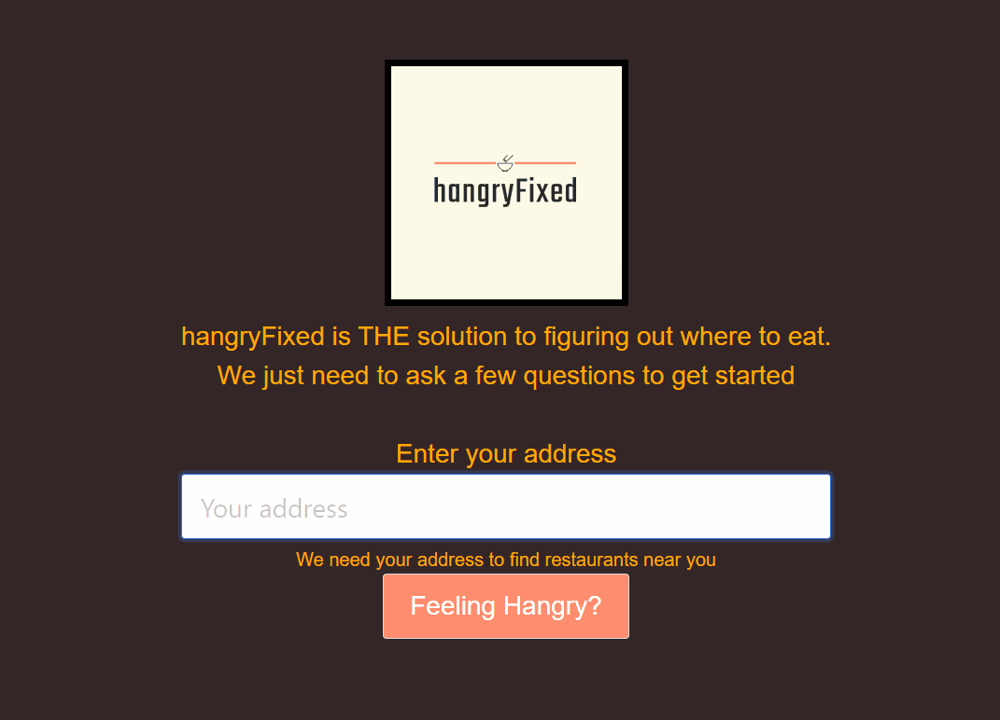

# hangryFixed

## About the project

This application provide the solution the constant battle of indecision on where to eat.

---

## User Story

    As A picky and indecisive eater
    I want to search restaurants near me
    That fullfills some search criteria such as price, location and offering take-out.
    
    As a gathering of big group of people
    I want an application that will randomly choose a restaurant
    So that we don't waste time figuring out where to eat.

---

## Getting started
Below are the prerequisite understanding and programs that were utilized :
* Visual Studio Code-click [here](https://code.visualstudio.com/) to a tutorial to install
* Github repository-click [here](https://help.github.com/en/github/)

* Bulma-click [here](https://bulma.io/documentation/)

* jQuery-click [here](https://code.jquery.com/jquery-3.4.1.min.js)

* aJax- click [here](https://cdnjs.cloudflare.com/ajax/libs/moment.js/2.24.0/moment.min.js)

* sweetalert- click [here](https://github.com/t4t5/sweetalert)

* Yelp API- click [here](https://www.yelp.com/developers/documentation/v3)

* Googlemaps API- click [here](https://developers.google.com/maps/documentation/javascript/tutorial)
---

## Code spotlight

The code snippet below does the following:

- create a function that will determine if the user input form is empty
- if the form is empty, a modal alert will let the user know to enter an address
- if the form is filled, it will take the input and reformat the user input into an accepted form for the application.
```js
{
     function validateForm() {
            if (userAddressInput == "") {
                swal({
                    icon: "error",
                    text: "Please enter an address, even the city will work!",
                    button: "Ok"
                });
                return false;
            }
            else {
                buildUserAdrress()
                fetchLocation(buildUserAdrress())
                window.open(href = "food-category.html");

            };
        };

        function buildUserAdrress() {
            return encodeURI(userAddressInput)
        };

}
```
## Demo



---

## Deployed link

[Live site](https://idelmundo.github.io/hangryfixed/)
---

## Author

**Mai Banh**
- [Link to Github](https://github.com/mtbanh)
- [Link to LinkedIn](https://www.linkedin.com/in/mai-banh-311ba6164/)

**Joe Davis**
- [Link to Github](https://github.com/mtbanh)
- [Link to LinkedIn](https://www.linkedin.com/in/mai-banh-311ba6164/)

**Isaias Del Mundo**
- [Link to Github](https://github.com/mtbanh)
- [Link to LinkedIn](https://www.linkedin.com/in/mai-banh-311ba6164/)

See also the list of [contributors](https://github.com/your/project/contributors) who participated in this project.

